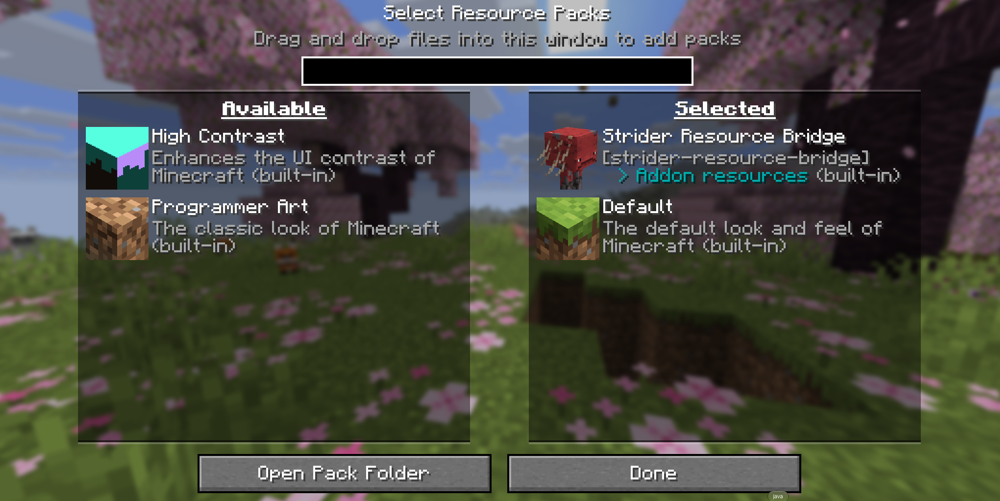

  

**strider-resource-bridge** is an addon connecting Minecraft's resource system with StriderLoader addon resources.

With strider-resource-bridge, addon resources are now accessible in the **Resource Packs** menu.

Each addon's Resource Pack uses the icon at `/assets/<addon id>/icon.png`.
If no icon could be found, the default Resource Pack icon will be used.

## Screenshot

## License

**GNU General Public License v3.0 only** — see the [LICENSE file](./LICENSE).
